<div align="center">


# 🛡️ RIFT Forensics Engine
### *Next-Generation Money Muling & AML Detection Network*

[](https://rift-forensic.vercel.app/)
[](https://github.com/Kowalskiye/Riftforensic)
[](https://opensource.org/licenses/MIT)

<br>

[](https://reactjs.org/)
[](https://threejs.org/)
[](https://python.org/)
[](https://fastapi.tiangolo.com/)
[](https://pandas.pydata.org/)
[](https://networkx.org/)
[](https://vercel.com/)
[](https://render.com/)

<br>

> **🏆 RIFT 2026 Hackathon · Deep Graph Analytics / RegTech Track 🏆**
>
> *An enterprise-grade, high-throughput topological intelligence system engineered to autonomously untangle multi-layered financial crime and fraud syndicates.*

<br>
</div>

---

## ⚡ The Challenge & The RIFT Solution

### The Crisis
Global financial institutions lose trillions of dollars annually to increasingly sophisticated money laundering networks. Traditional rules-based Anti-Money Laundering (AML) systems suffer from two critical failures:

- **Catastrophic false-positive rates** — they flag legitimate corporate payroll and bulk processors as suspicious, wasting investigator time and resources.
- **Inability to detect non-linear threats** — they miss complex, multi-hop laundering syndicates that span dozens of accounts and transactions.

The result is that financial criminals operate with near impunity, exploiting the blind spots of legacy detection systems.

### The Solution
We engineered the **RIFT Forensics Engine** — a real-time RegTech platform that ingests raw transactional datasets and transforms them into actionable intelligence. Instead of simple rule-matching, RIFT builds a full mathematical graph of every financial relationship in the dataset, then runs deep graph-theoretic algorithms to expose criminal network structures that are invisible to traditional tools.

Key capabilities:
- Detects **cyclic layering** — money that loops through multiple accounts to obscure its origin
- Identifies **smurfing** — large sums split into small deposits across many accounts to avoid reporting thresholds
- Exposes **shell networks** — chains of dummy accounts used to create distance between dirty money and its source
- Eliminates false positives by automatically whitelisting high-volume legitimate processors like payroll systems

All of this runs in **sub-30-second execution windows**, even on large datasets.

---

## 🛠️ Enterprise Tech Stack & Infrastructure

### 🎨 Frontend & Visualization

| Technology | Badge | Role |
| :--- | :--- | :--- |
| **React 18** | [](https://reactjs.org/) | Powers the entire UI with a component-based architecture and virtual DOM for lightning-fast state updates. Manages file upload, analysis state, error handling, and rendering the dashboard. |
| **Three.js** | [](https://threejs.org/) | GPU-accelerated WebGL 3D rendering engine. Renders the force-directed transaction graph in real-time, mapping thousands of account nodes and transaction edges in an interactive 3D space the user can rotate and explore. |
| **Vite** | [](https://vitejs.dev/) | Ultra-fast frontend build tool and dev server. Delivers instant hot module replacement during development and highly optimized production bundles for fast page loads. |

### 🧠 Backend & API

| Technology | Badge | Role |
| :--- | :--- | :--- |
| **Python 3.11** | [](https://python.org/) | Core language for all backend computation. Python 3.11 delivers significant performance improvements critical for processing large transactional datasets with complex graph algorithms. |
| **FastAPI** | [](https://fastapi.tiangolo.com/) | High-performance async web framework. Handles multipart CSV file uploads, validates inputs, runs the analysis pipeline, and returns structured JSON results. Also provides auto-generated interactive API docs at `/docs`. |
| **Uvicorn** | [](https://www.uvicorn.org/) | ASGI server that runs the FastAPI application. Supports asynchronous request handling for high concurrency, ensuring the backend can process multiple simultaneous uploads without blocking. |

### 📊 Data & Graph Analytics

| Technology | Badge | Role |
| :--- | :--- | :--- |
| **Pandas** | [](https://pandas.pydata.org/) | Vectorized in-memory data processing. Ingests the uploaded CSV, normalizes column names, validates data types, and restructures raw transaction rows into sender/receiver/amount edge lists ready for graph construction. |
| **NetworkX** | [](https://networkx.org/) | Industry-standard Python graph library. Constructs a Directed Weighted Graph from the transaction edge list and runs all graph-theoretic algorithms — cycle detection, degree analysis, betweenness centrality, and sub-graph isomorphism. |

### ☁️ Cloud Infrastructure

| Technology | Badge | Role |
| :--- | :--- | :--- |
| **Vercel** | [](https://vercel.com/) | Hosts and serves the React frontend via a global edge network with automatic CI/CD. Every push to the `main` branch triggers an automatic rebuild and deployment with zero downtime. |
| **Render** | [](https://render.com/) | Hosts the Python FastAPI backend as a containerized web service. Automatically deploys on every GitHub push and provides scalable compute for heavy graph analysis workloads. |

---

## 🧬 Algorithmic Core & Graph Theory

At the heart of RIFT is a multi-pass graph analysis engine. Once the transaction data is loaded into a NetworkX Directed Graph, the engine runs four independent detection passes simultaneously, then aggregates their outputs into a final threat score.

### 🌐 Pass 1 — Graph Construction & Topological Ingestion
Every unique account ID in the dataset is instantiated as a **vertex (node)** in the directed graph. Every transaction becomes a **directed weighted edge** from sender to receiver, with the transaction amount stored as the edge weight. This transforms a flat CSV into a rich mathematical structure that encodes every financial relationship in the dataset simultaneously.

### 🌀 Pass 2 — Deep Cycle Enumeration (Layering Detection)
The "layering" phase of money laundering involves moving money through a series of accounts in a loop to disguise its origin. RIFT detects this by running an optimized **Depth-First Search (DFS)** across the entire graph, specifically hunting for **elementary cycles of length 3, 4, and 5** — three, four, or five accounts passing money in a ring. Any account participating in such a cycle is immediately flagged as a critical-risk entity.

### 🕸️ Pass 3 — Structural Smurfing Identification
Smurfing involves breaking large sums into many small transactions to avoid detection thresholds. It creates a distinctive graph signature: one account receiving from many small senders (fan-in), or one account sending to many small receivers (fan-out). RIFT detects this by analyzing **asymmetric vertex degree ratios** — accounts with abnormally high in-degree relative to out-degree (aggregation mules) or vice versa (dispersal distributors) are flagged.

### 🏚️ Pass 4 — Shell Network & Bridge Node Detection
Shell networks create long chains of dummy accounts between the source and destination of laundered funds. RIFT identifies these using **sub-graph isomorphism** to find chain patterns, and **betweenness centrality** analysis to find critical bridge nodes — accounts that sit on the shortest path between many other accounts, acting as the connective tissue of the laundering network.

### 🛡️ False Positive Filter — Super-Node Heuristic
A known weakness of graph-based AML systems is flagging legitimate high-volume processors — payroll systems, payment gateways, utility companies — that naturally have very high transaction degrees. RIFT neutralizes this by identifying any node with `degree > 50` and running it through a temporal cross-reference. If the transactions are evenly distributed across regular time intervals (consistent with automated payroll), the entity's threat score is hard-reset to `0.0` and excluded from all reports.

---

### 🚨 Threat Scoring Matrix

Each entity's final threat score is computed by summing weighted signals from all detection passes:

| Vector Signal | Threat Weight | Description | Impact |
| :--- | :---: | :--- | :---: |
| **Deep Cycle Participation** | +50 base, +10 per extra cycle | Entity participates in a circular money loop — strongest indicator of layering | 🔴 **Critical** |
| **Layered Shell Sub-Graph** | +40 | Entity sits inside a chain of dummy accounts designed to obscure the money trail | 🟠 **High** |
| **Fan-Out Dispersal Pattern** | +35 | Receives large sum and disperses to many accounts — integration laundering signature | 🟡 **Medium** |
| **High Centrality Bridge Node** | +15 | Betweenness centrality > 0.1 — connects otherwise separate criminal clusters | 🟣 **Elevated** |
| **Super-Node Clearance** | Reset to 0.0 | Degree > 50 with regular temporal pattern — cleared as legitimate bulk processor | 🟢 **Cleared** |

---

## 🔬 Detection Algorithm Flowchart

```mermaid
graph TD;
    A[📁 CSV File Upload] -->|Multipart Form Data| B(Pandas Normalization & Validation);
    B -->|Build Weighted Edges| C{NetworkX DiGraph Engine};

    C -->|Recursive DFS lengths 3-5| D[🌀 Cycle / Layering Detection];
    C -->|Degree Asymmetry Analysis| E[🕸️ Smurfing / Structuring Detection];
    C -->|Sub-graph Isomorphism| F[🏚️ Shell Network Extractor];
    C -->|Betweenness Centrality| G[🌉 Bridge Node Identifier];

    D --> H(Heuristic Risk Scoring 0-100);
    E --> H;
    F --> H;
    G --> H;

    H -->|degree > 50 check| I{Super-Node Filter};
    I -->|Legitimate Payroll| J[✅ Score Reset to 0.0];
    I -->|Confirmed Threat| K[🚨 Flag Entity];

    K --> L[🌐 3D WebGL Force Graph];
    K --> M[📊 Risk Dashboard & SAR Export];

    classDef upload fill:#1e293b,stroke:#3b82f6,stroke-width:2px,color:#fff;
    classDef engine fill:#0f172a,stroke:#8b5cf6,stroke-width:2px,color:#fff;
    classDef detection fill:#1a1a2e,stroke:#ef4444,stroke-width:2px,color:#fff;
    classDef output fill:#0d2137,stroke:#00e5a0,stroke-width:2px,color:#fff;
    classDef safe fill:#0f2d1f,stroke:#22c55e,stroke-width:2px,color:#fff;

    class A,B upload;
    class C,H,I engine;
    class D,E,F,G detection;
    class L,M output;
    class J safe;
    class K detection;
```



---

## 🏗️ System Architecture

<details>
<summary><b>👁️ Click to view the Data Flow Architecture Diagram</b></summary>
<br>

```text
[ Secure Client Environment ]
   │
   ▼ Multipart Form Data Stream (CSV)
┌────────────────────────────────────────────────────────┐
│  Presentation & WebGL Engine (Vercel Global Edge)      │
│  · Client-side Sanitization & State Management         │
│  · Three.js 3D Force-Directed Topology Renderer        │
│  · Dynamic Risk-Matrix Dashboard & SAR Export          │
└──────────────────────────┬─────────────────────────────┘
                           │ Asynchronous POST /analyze
                           ▼
┌────────────────────────────────────────────────────────┐
│  Analytics & ML Heuristics API (Render Cloud Compute)  │
│  · High-Speed Vectorized Normalization (Pandas)        │
│  · Directed Acyclic/Cyclic Graph Generation (NetworkX) │
│  · Sub-Graph Isomorphism & Deep Cycle Enumeration      │
│  · O(1) Look-up Temporal Heuristic Filtering Engine    │
└────────────────────────────────────────────────────────┘
```

</details>

---

## 🚀 Local Deployment Guide

### Prerequisites

| Requirement | Minimum Version | Download |
| :--- | :--- | :--- |
| Python | 3.11+ | https://python.org/downloads |
| Node.js | 18+ | https://nodejs.org |
| Git | Latest | https://git-scm.com |

---

### 1. Clone the Repository

```bash
git clone https://github.com/Kowalskiye/Riftforensic.git
cd Riftforensic
```

---

### 2. Terminal 1 — Start the Backend (FastAPI)

Open your first terminal and run:

```bash
# Navigate to the backend folder
cd backend

# Create a Python virtual environment (keeps dependencies isolated)
python -m venv venv

# Activate the virtual environment
# On Windows:
venv\Scripts\activate
# On macOS / Linux:
source venv/bin/activate

# Install all Python dependencies
pip install -r requirements.txt

# Start the FastAPI development server
uvicorn main:app --reload --port 8000
```

✅ Backend API running at: **`http://127.0.0.1:8000`**  
✅ Interactive API docs at: **`http://127.0.0.1:8000/docs`**

> The `--reload` flag makes the server restart automatically whenever you edit backend code — useful during development.

---

### 3. Terminal 2 — Start the Frontend (Vite + React)

Open a **second terminal** (keep the first one running) and run:

```bash
# Navigate to the project root
cd Riftforensic

# Copy the environment config file
cp .env.example .env        # macOS / Linux
# On Windows: copy .env.example .env

# Install all JavaScript dependencies
npm install

# Start the Vite development server
npm run dev
```

✅ Frontend running at: **`http://localhost:5173`**

> The `.env` file configures the frontend to point at your local backend (`http://127.0.0.1:8000`). Do not commit this file — it is already listed in `.gitignore`.

---

### 4. Using the Application

1. Open **`http://localhost:5173`** in your browser
2. Click the **"Upload"** button in the top right
3. Select a CSV file with columns: `sender`, `receiver`, `amount` — see `test_upload.csv` in the repo root for a sample
4. Wait for analysis to complete (typically 5–15 seconds locally)
5. Explore the **interactive 3D graph** — red nodes are high-risk, green are cleared
6. Review the **Risk Dashboard** for full threat scores and pattern breakdowns

---

## ☁️ Production Deployment

The live production version uses a fully decoupled architecture:

| Service | Platform | Live URL |
| :--- | :--- | :--- |
| 🎨 Frontend | Vercel | https://rift-forensic.vercel.app |
| 🧠 Backend | Render | https://riftforensic-backend.onrender.com |

> ⚠️ **Render Free Tier Notice:** The backend automatically spins down after 15 minutes of inactivity. The first upload after an idle period may take up to 50 seconds while the server wakes up — subsequent requests will be fast. Upgrading to a paid Render instance eliminates this cold-start delay entirely.

---

<div align="center">
<i>Engineered with precision for the future of decentralized financial security.</i>
</div>
